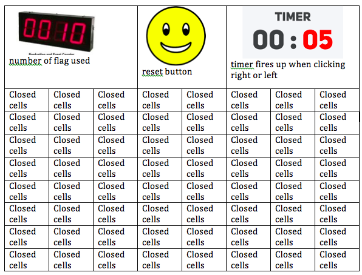

<a name="goback">

#  MineSweeper

##  Live: https://esraa-alaarag.github.io/Minesweeper/

##  Table of Contents

1. [Game description](#appdescription)
2. [User Stories](#userstories)
3. [Technologies used](#technologies)
4. [Pseudocode](#pseudocode)
5. [Wireframes Web Version](#wireframesweb)
6. [Ways to see the project](#project)

<a name="appdescription">

## Game Description :
The goal of this game is to clear all the cells from a grid. if player clicks on the cell which contains a bomb, the bomb explodes and the game is over.
The Minesweeper game is controlled only by mouse. Right click opens a cell. Left click puts a flag on the cell as a reminder that a bomb `text=10 ` might be there. To remove a flag, right click the cell again. A cell can contain a number from 1 to 8, or it can be blank `text=0`. The number indicates how many mines are adjacent to this particular cell.
</a>

<a name="userstories">

## User Stories

*	As a newbie game player, I want to know the game instruction.
*	As a player, I would like to reset my game any time during the game.
*	As a player, I want to be able to flag or unflag any cell in the grid.
*	As an expert player, I want to be able to see how it took me to finish the game.
*	As a player, I want to see how much bomb left for me.
 </a>
 
<a name="technologies">

## Technologies used

This game was written using html, CSS, JavaScript, JQuery and Bootstrap
</a>
<a name="pseudocode">

## PSEUDOCODE:

On start the game will grab all the cells by selecting `.square` class. all the divs will have `text=0` initially. A function called random will distribute the bomb randomly across the grid by setting `text=10`. Then another function will be called to generate the number clues which surrounds each bomb `text= (any value from 1-8)`.

A cell can be surrounded by maximum of 8 bombs, so we need images for numbers 1 to 8. also, we need images for the covered cells, a bomb, an exploded mine. an image when game is over, a flag. There is a Class for each one One, Two, Three, Four, Five, Six, Seven, Eight, bomb, clicked, Flag, open, closed.

### Displaying the numbers in the cells adjacent to a bomb

Here is the algorithm in pseudocode:

*	create larger table so for example if the original grid is 8x8 create 10x10 to solve the problem when the cells located in boundaries.
*	feed the larger table with the original grid.
*	For each cell that has a mine at row r and column c.
*	Loop for all rows r-1, r, r+1.
*	Loop for all columns c-1, c, c+1 If the cell has no mine.
*	Add 1 to the contents of the cell.
* Return the values back to the original grid. 

### Opening adjacent empty cells

The function is similar to the previous function but the program will not check in 8 directions. Instead, it will check only 4 directions because the function is recursive so even the program is checking 4 direction all other cells will be cleared eventually.

when player clicks a cell, the call’s class will be remove and/or added or toggles. which will control the display of the cell. Then, the mouse click will be disabled on that clicked cell. The timer will start with the first right or left click on the grid.

When player clicks empty cell, the surrounded cells - if text=0 which mean empty cell -will open up until a number or bomb or boundary is reached using recursive function.

Player will win After opening all the cells without clicking on any bomb.
</a>

<a name="wireframesweb">

## Wireframes

### step1

### step2

### step3

</a>

<a name="project">

## SEE THE PROJECT:

### Live Deployment of App: https://esraa-alaarag.github.io/minesweeper/

### Github : https://esraa-alaarag.github.io/Minesweeper/

