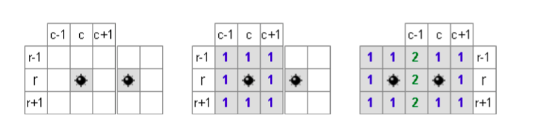
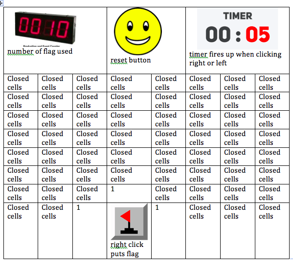
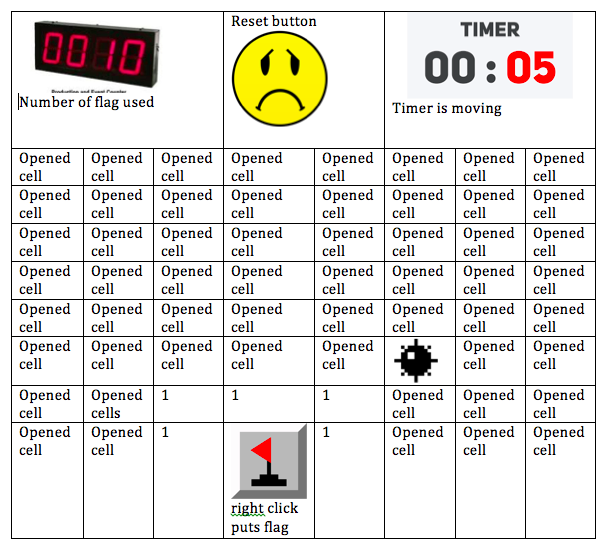

# MineSweeper

**Minesweeper** goal is to clear all the cells from a grid. If the player clicks on the cell which contains a bomb, the bomb explode and the game is over.

The Minesweeper game is controlled only by mouse. user can click left or right clicks. Right click opens a cell . Left click puts a flag on the cell as a reminder that a bomb=10 might be underneath the cell.To remove a flag click right click again 
A cell can contain a number(1,2,3,4,5,6,7,8) or it can be blank=0. The number indicates how many mines are adjacent to this particular cell. 

##Technologies used
The program was written useing html , css, JS and JQuary 

## Approach taken
On start the program will grap all the cells by selecting `.square` class. all the divs will have `text=0` intially . The a random function will be called to distribute the bomb randomly in the grid by setting the `text=10` . Then another function will be called to generate the number clues which surrounds each bomb `text=any value from 1-8`.

A cell can be surrounded by maximum of 8 bombs, so we need images for numbers  1-8.also  We need images for a covered cell, a bomb, a exploded mine . an image when game is over, a flag. There is a Class for each one (One, Two, Three, Four, Five, Six, Seven, Eight, bomb, clicked, Flag, open,closed).

upon user click the a class will be remove and/or added or toggles. which will control the display of the cell. and the mouse click will be disabled on that clicked cell. The timer will start when clicking left or right on the grid.

when clicking empty cell the surrounded cells `if = 0` will open up until a number or bomb or bound is reached useing recursive function.

After opening all the cells an alert will be displayed and a picture will be displayed.

## User Stories

* As a newbie game player, I want to know who goes first so we can start the game.”
* ”As a player, I would like to reset my game any time
during the game.”;
* ”As a player, I want to be able to flag or unflag any cell in the grid”;
* ”As an expert player, I want to be able to see how much I took to finish the game”;
* ”As a player, I want to see how much bomb left for me”;

## Wireframes
### step1

### step2

### step3

## How to use instructions
The purpose of the game is to open all the cells of the board which do not contain a bomb. You lose if you set off a bomb cell.
Every non-bomb cell you open will tell you the total number of bombs in the eight neighboring cells. Once you are sure that a cell contains a bomb, you can right-click to put a flag it on it as a reminder.
To start a new game (abandoning the current one), just click on the yellow face button.
Happy mine hunting!

## Testing
The game was given to 8 years old boy to test and find the glitches then I solved all the found glitches. 

## Unsolved problems
I was supposed to use a class I did not use it because it did not work with 2d array intially and the logic was so complicated that it took too much time espcially the recursive function. I did not find enough time to rewrite the program using the classes.
